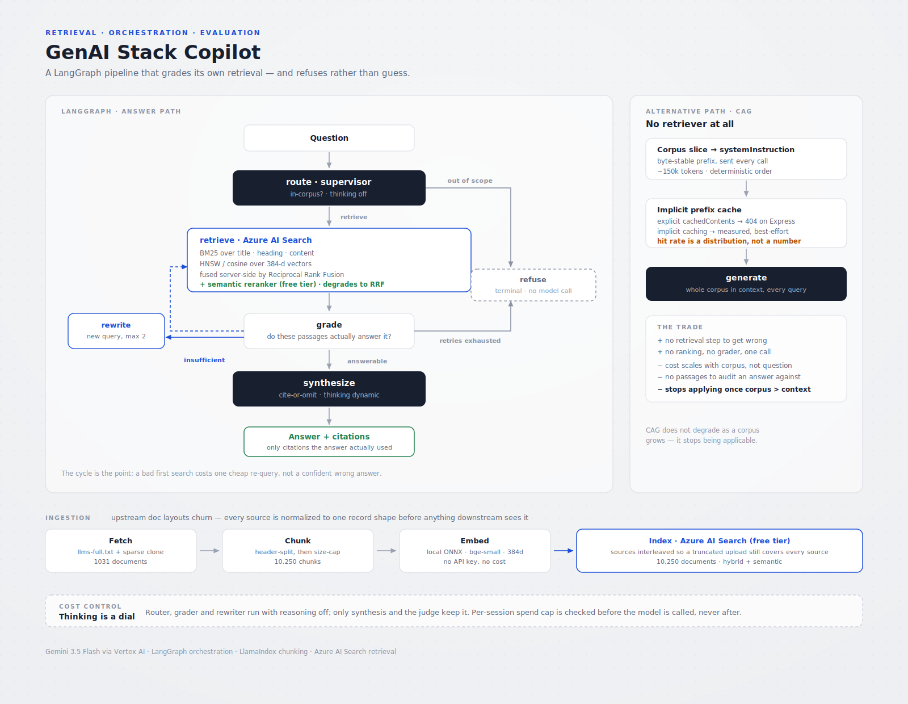

# GenAI Stack Copilot

A retrieval assistant over the **LangChain, LangGraph, LangSmith and LlamaIndex**
documentation. It cites what it uses, grades its own retrieval before answering,
and refuses when the corpus doesn't cover the question.

It also implements the same task a second way — **cache-augmented generation**,
with no retriever at all — and measures both against the same question set.



**Stack:** LangGraph (orchestration) · LlamaIndex (chunking) · Azure AI Search
(hybrid retrieval) · Gemini 3.5 Flash via Vertex AI · FastAPI · fastembed (local
ONNX embeddings)

---

## Why this exists

Most RAG demos are a single `retrieve → generate` call. That shape has no way to
notice it retrieved the wrong thing, so it answers confidently either way. The
interesting engineering is in what happens when retrieval *fails*, and in being
able to prove — with numbers — that it fails honestly.

So this project is built around three questions:

1. Can the pipeline tell when its own retrieval was insufficient?
2. Does it refuse, or does it invent?
3. What does the alternative (CAG) actually cost, measured rather than assumed?

---

## The graph

```
route ──┬─► retrieve ─► grade ──┬─► synthesize ─► answer + citations
        │        ▲              │
        │        └── rewrite ◄──┤  insufficient, attempts < 2
        │                       │
        └────────────────────────► refuse
           out of scope            retries exhausted
```

**The cycle is the point.** A grader sits between retrieval and generation. If
the passages don't actually contain the answer, the graph rewrites the query
(using documentation vocabulary rather than the user's phrasing) and searches
again, up to twice, before giving up honestly. A bad first search costs one
cheap re-query instead of producing a confident wrong answer.

**Refusal is a terminal node, not a fallback string.** There is no path from
`route` to `synthesize` that skips the grade. And `refuse` deliberately makes
*no model call* — asking a model to explain why it has no information is exactly
the moment it starts inventing some.

### Three ways to be wrong, not one

The evaluation set covers all three, because a retrieval system that only
measures "gave a good answer" ships as one that answers everything:

| Category | Correct behaviour | The failure it catches |
|---|---|---|
| `answerable` | answer, with citations | missing what it should know |
| `out_of_scope` | refuse | answering trivia it has no basis for |
| `not_in_corpus` | refuse | **the expensive one** — plausible-sounding invention |

---

## Measured results

22 questions, judged by `gemini-3.5-flash` strictly against the passages the
pipeline actually retrieved. Raw output in [`data/evals/`](data/evals/).

| Metric | Result |
|---|---|
| Judge failures | **0** / 15 judged |
| Answer rate on `answerable` | **100%** (15/15) |
| Correct refusal rate | **100%** (7/7) |
| **False answers** (invented on a question it couldn't source) | **0** |
| Groundedness (1–5) | 5.00 |
| Relevance (1–5) | 5.00 |
| Answers containing unsupported claims | 0 |
| Median latency | 19.1 s |
| Total cost, all 22 questions | **$0.17** (~$0.008/question) |

**The number that matters is `false answers: 0`** — across 4 out-of-scope
questions and 3 that sound in-domain but aren't covered, it refused every time
instead of producing something plausible.

### Where I'd push back on my own numbers

**Groundedness of 5.00 across all 15 is too clean to take at face value.** A
judge that returns full marks for everything is indistinguishable from a broken
one, which is exactly the failure this project hit once already (see bug 3).

What I did check: the judge *discriminates*. Fed a deliberately fabricated claim
("Python was created in 1823 by Ada Lovelace") against a passage that didn't
support it, it returned groundedness **2/5** and named the invention. So it is
not rubber-stamping.

What that still doesn't prove: that the question set is *hard enough to
separate good from mediocre*. A uniform top score means the benchmark has no
resolution left — every question landed in material the corpus covers well. The
honest reading is "no grounding failures detected on this set," not "grounding
is solved." A harder set — ambiguous phrasing, questions spanning two documents,
near-miss terminology — would be the next thing to build.

**Latency is not good.** A 19-second median is fine for a documentation lookup
and too slow for anything interactive. Most of it is the synthesis call with
reasoning enabled; dropping it would cut latency and quality together.

---

## Decisions worth explaining

### Retrieval is hybrid, and degrades instead of failing

Every query carries both BM25 keyword search and an HNSW vector query; Azure
fuses them server-side with Reciprocal Rank Fusion. A lexically obvious question
("what is `ef_construction`") and a purely semantic one ("how do I stop the
agent halfway") both land.

Semantic (L2) reranking is attempted, and a failure **downgrades to plain hybrid
rather than erroring** — the reranker isn't available on every service tier, and
a demo that dies from a tier limit is worse than one that returns slightly
coarser ranking. The response records which path actually ran.

*(As it turned out, the Azure free tier includes the semantic ranker — but the
fallback is what made it safe to find that out in production rather than in
the docs.)*

### Thinking is a dial, and it is expensive by default

`gemini-3.5-flash` spent **475 thought tokens** answering *"what is a cycle in a
directed graph"* — a one-line question. With `thinkingBudget: 0` that drops to
**0**.

So the router, grader and query-rewriter all run with reasoning **off**. Only
synthesis (which must reconcile several passages and attribute each claim) and
the eval judge (which must check each claim against the passages) keep it on.
Left at the default, three classifier calls would have dominated the cost of
every request.

### Embeddings run locally

`bge-small-en-v1.5` via ONNX — no API key, no per-token cost, and the repo runs
end to end for anyone who clones it. Swapping to Azure OpenAI embeddings means
changing one function and the index's vector dimension, not rewriting the
pipeline.

### Ingestion normalizes, because upstream layouts churn

All three original sources moved during this build:

- LangGraph **stopped shipping markdown docs** in its repo (now `llms-full.txt`)
- LlamaIndex moved docs to `docs/src/content`
- Microsoft **removed Azure Search docs from `azure-docs` entirely**

So fetching is per-source and everything normalizes to one record shape
(`title`, `url`, `content`) before the chunker sees it. Adding or repairing a
source touches one fetcher, not the pipeline. That churn is the normal state of
documentation, not bad luck.

### The upload measures instead of assuming

The free tier caps at 50 MB, and indexed size isn't predictable from raw chunk
size (vectors are stored binary; text gets an inverted index on top). So the
uploader polls index statistics as it goes and stops before the ceiling.

Sources are **interleaved** rather than uploaded one after another, so if it
does stop early, a prefix still covers every source instead of silently dropping
a whole corpus.

---

## Three bugs worth keeping in the write-up

Two of these share a theme: **a check that fails silently is worse than no
check, because you stop looking at it.**

**1. A safety check that silently did nothing.**
`GetIndexStatisticsResult` has a `.get()` method — but it does not read model
fields. `stats.get("storage_size", 0)` returns `0` forever, with no error. The
storage guard above was therefore a no-op on its first run: it logged
`0.0 MB / 0 docs` for all 10,250 uploads and would have let the upload run until
Azure rejected it. Fixed to attribute access. *A safety check that fails silently
is worse than none, because you stop looking.*

**2. Statistics that lag reality.**
That same endpoint reported **0 documents while the index was already serving all
10,250** — confirmed with `search_text="*"` and `include_total_count=True`. Index
statistics are advisory; if you need a real count, query for it.

**3. A JSON Schema that is valid everywhere except here.**
The eval judge failed on **100% of calls** on its first run, and the summary
reported `groundedness_mean: null` — which reads like "no data" rather than
"the judge is completely broken." The cause:

```
400 Invalid value at 'generation_config.response_schema.properties[0].value.enum[0]'
    (TYPE_STRING), 1
```

Gemini's `responseSchema` requires `enum` values to be **strings**.
`{"type": "integer", "enum": [1,2,3,4,5]}` is perfectly valid JSON Schema and is
rejected outright; bounded integers need `minimum`/`maximum`. String enums (used
by the router and grader) are fine, which is why only the judge broke.

Two fixes, not one: the schema, *and* the fallback now returns `None` with a
`JUDGE_FAILED` marker and the summary reports `judge_failures` as its **first**
line — so a broken judge can never again masquerade as a missing metric.

The judge was then verified to *discriminate*, not merely respond: fed a
deliberately fabricated claim, it returned groundedness 2/5 and named the
invention. A judge that rubber-stamps is worse than no judge.

---

## Running it

```bash
python -m venv .venv && .venv/Scripts/pip install -r requirements.txt
cp .env.example .env          # fill in GOOGLE_API_KEY + Azure Search values

python -m src.ingest.fetch_corpus     # normalize sources  -> data/corpus/*.jsonl
python -m src.ingest.build_chunks     # chunk + embed      -> data/chunks.jsonl
python -m src.retrieval.upload        # create index + push

uvicorn src.app:app --reload          # http://localhost:8000
```

Evaluation:

```bash
python -m src.evals.run_evals         # RAG scored on all three categories
python -m src.evals.compare           # RAG vs CAG, same questions
```

### Deploying

Container Apps, built from source — no local Docker or registry needed:

```bash
az group create -n genai-copilot-rg -l polandcentral
az containerapp up \
  --name genai-stack-copilot \
  --resource-group genai-copilot-rg \
  --location polandcentral \
  --source . \
  --ingress external --target-port 8000 \
  --env-vars GOOGLE_API_KEY=secretref:google-key \
             AZURE_SEARCH_ENDPOINT=... \
             AZURE_SEARCH_KEY=secretref:search-key \
             SESSION_COST_CAP_CENTS=25
```

Deployed **separately from any production infrastructure**, in its own resource
group. The image bakes the embedding model at build time so a cold replica
doesn't spend its first request downloading 130 MB.

**Scale it to one replica**, or move the spend cap to shared state first — see
*What I'd change*.

---

## Corpus

| Source | Documents | Fetched via |
|---|---|---|
| LangChain / LangGraph / LangSmith | 857 | `docs.langchain.com/llms-full.txt` |
| LlamaIndex | 174 | sparse clone of `docs/src/content` |
| **Total** | **1,031** → 10,250 chunks | all indexed |

Chunks are header-split first (so one chunk rarely straddles two topics), then
size-capped at 800 tokens with 100 overlap, then deduplicated by content hash —
ids are content hashes, so re-running over unchanged docs is idempotent.

---

## What I'd change

- **The spend cap is process-local.** Fine for a single-instance demo, wrong for
  a scaled one. It belongs in Redis or a table before this runs on more than one
  replica — noted in the Dockerfile rather than quietly ignored.
- **The corpus contains both Python and JavaScript variants** of the LangChain
  docs, so an answer sometimes cites the same page twice in two languages.
  Deduplicating by canonical page would tighten citations.
- **The grader is a single call with no self-consistency.** For a system where a
  wrong "answerable" is expensive, two graders with disagreement escalating to a
  refusal would be stricter.

---

*Built by Adam Bok · [frameworkzero.com](https://frameworkzero.com)*
